# 多型

<!-- TOC -->
* [多型](#多型)
  * [多型 (Polymorphism)](#多型-polymorphism)
    * [特性](#特性)
    * [用途](#用途)
      * [集合](#集合)
      * [方法](#方法)
      * [變數型別](#變數型別)
  * [轉型（Type Casting）](#轉型type-casting)
    * [基本型別轉型](#基本型別轉型)
      * [隱式轉型（Widening Casting）](#隱式轉型widening-casting)
      * [顯式轉型（Narrowing Casting）](#顯式轉型narrowing-casting)
    * [物件型別轉型](#物件型別轉型)
      * [向上轉型（Upcasting）](#向上轉型upcasting)
      * [向下轉型（Downcasting）](#向下轉型downcasting)
  * [重點整理](#重點整理)
<!-- TOC -->

## 多型 (Polymorphism)

`多型`是`Java`中的一個重要概念，指的是「同一個方法或行為在不同的對象上可以表現出不同的形式」。
這是一種透過共用接口或基底類別來統一操作的能力，使程式設計更加靈活和可擴展。

### 特性

- `型別`是決定方法的能見度，而`實例`是決定方法的執行。
- 有效解決方法`多載`過多問題。
- `繼承`和`實作`才可以獲得`多型`的特性。

首先，先把動物的繼承關係建立起來。

建立`Animal`：

```java
public interface Animal {

  void eat();

  void sleep();

}
```

建立`Cat`類別，並實作`Animal`介面。

```java
public class Cat implements Animal {

  @Override
  public void eat() {
    System.out.println("Cat eating");
  }

  @Override
  public void sleep() {
    System.out.println("Cat sleeping");
  }

}
```

建立`Dog`類別，並實作`Animal`介面。

```java
public class Dog implements Animal {

  @Override
  public void eat() {
    System.out.println("Dog eating");
  }

  @Override
  public void sleep() {
    System.out.println("Dog sleeping");
  }

}
```

建立`main`方法：

```java
public static void main(String[] args) {
  Cat cat = new Cat();
  cat.eat();
  cat.sleep();
  Dog dog = new Dog();
  dog.eat();
  dog.sleep();
}
```

有發現一個問題嗎? 只要新增一種動物，就要重複寫一模一樣的程式，因為`eat()`和`sleep()`
都會重複呼叫，這時候就可以運用多型來解決。

### 用途

讓我們透過實作了解，各種情境使用多型的`前後差別`。

#### 集合

來觀察在集合上應用泛型的差別。

**使用前：**

使用`List`時，就只能儲存特定物件。

```java
public static void main(String[] args) {
  List<Cat> catList = new ArrayList<>();
  List<Dog> dogList = new ArrayList<>();
  catList.add(new Cat());
  dogList.add(new Dog());
  catList.foreach(cat -> {
    cat.eat();
    cat.sleep();
  });
  dogList.foreach(dog -> {
    dog.eat();
    dog.sleep();
  });
}
```

**使用後：**

讓`List`可以傳入所以跟`動物類型`繼承關係的物件。

```java
public static void main(String[] args) {
  List<Animal> animalList = new ArrayList<>();
  animalList.add(new Cat());
  animalList.add(new Dog());
  animalList.foreach(animal -> {
    animal.eat();
    animal.sleep();
  });
}
```

#### 方法

來觀察在方法上應用泛型的差別。

**使用前：**

只能傳入特定型別參數。

```java
public class Example {

  public static void main(String[] args) {
    doCatAction(new Cat());
    doDogAction(new Dog());
  }

  public static void doCatAction(Cat cat) {
    cat.eat();
    cat.sleep();
  }

  public static void doDogAction(Dog dog) {
    dog.eat();
    dog.sleep();
  }

}
```

**使用後：**

透過多型，簡化方法的傳入參數，避免多載過多問題。

```java
public class Example {

  public static void main(String[] args) {
    doAnimalAction(new Cat());
    doAnimalAction(new Dog());
  }

  public static void doAnimalAction(Animal animal) {
    animal.eat();
    animal.sleep();
  }

}
```

#### 變數型別

來觀察在變數宣告上應用泛型的差別。

**使用前：**

變數的型別是直接指定的，所以可以呼叫特定方法。

```java
public static void main(String[] args) {
  Cat cat = new Cat();
  Dog dog = new Dog();
  cat.meow();
  dog.bark();
}
```

**使用後：**

變數的型別變成父類別，但是父類別裡沒有`meow`和`bark`，所以無法呼叫。

```java
public static void main(String[] args) {
  Animal cat = new Cat();
  Animal dog = new Dog();
  cat.meow(); //compiler error
  dog.bark(); //compiler error
  cat.call(); // compiler success
  dog.call(); // compiler success
}
```

型別是決定方法的能見度，所以使用時必須要了解型別是否正確。

## 轉型（Type Casting）

是將一種型別的物件或變數`轉換`為另一種型別的過程。這在多型或操作不同型別的資料時非常常見。
轉型可以分為`基本型別轉型`和`物件型別轉型`。

### 基本型別轉型

基本型別分為：

- 數值型別：`byte`, `short`, `int`, `long`, `float`, `double`
- 非數值型別：`char`, `boolean`

#### 隱式轉型（Widening Casting）

由小型別`自動`轉換為大型別。

- 數值基本形態有大小區分，小轉大過程保證安全，無資料遺失。
- 型別轉換順序 `byte` → `short` → `int` → `long` → `float` → `double`

```java
public static void main(String[] args) {
  int myInt = 10;
  double myDouble = myInt; // 自動轉型 int → double
  System.out.println(myDouble); // 輸出: 10.0
}
```

#### 顯式轉型（Narrowing Casting）

當大轉小必須`強制轉型`，因為是不安全的操作。

- 由大型別轉換為小型別，需`手動`轉型。
- 非數值型別`無法轉型`成數值型別。
- 若轉型超出大小範圍，會導致`資料遺失`或`資料不正確`。

```java
public static void main(String[] args) {
  double myDouble = 9.78;
  int myInt = (int) myDouble; // 強制轉型 double → int
  System.out.println(myInt); // 輸出: 9
}
```

### 物件型別轉型

物件型別轉型的前置條件，必須要有`繼承`或`實作`的行為，物件型別轉型有分為：

- 向上轉型（Upcasting）
- 向下轉型（Downcasting）

#### 向上轉型（Upcasting）

- 子型別轉為父型別，在宣告時會`自動轉型`。
- 父型別的引用`只能訪問`父型別中定義的`屬性`和`方法`。

```java
public static void main(String[] args) {
  Animal animal = new Dog(); // 子類型自動轉型為父類型
  animal.sound();
}
```

#### 向下轉型（Downcasting）

- 父型別轉型為子型別，需`手動`轉型。
- 若轉換型別錯誤，則會引發 `ClassCastException`錯誤。

```java
public static void main(String[] args) {
  Animal myAnimal = new Dog(); // 向上轉型
  Dog myDog = (Dog) myAnimal;  // 向下轉型
  myDog.bark(); // 需要手動轉型為Dog，才能訪問bark()方法
}
```

如果是這樣的例子`轉型`是否成功？

```java
public static void main(String[] args) {
  Dog dog = new Dog();
  Cat cat = (Cat) dog;
}
```

假如`Animal`是一個普通類別可以實例化，那這樣的轉型是否成功？

```java
public static void main(String[] args) {
  Animal animal = new Animal();
  Cat Cat = (Cat) animal;
}
```

轉型的依據是實例，所以會依照實例去決定可以轉成哪些型別。

可以套用直系和旁系血親的概念，因為直系有`直接關係`，旁系是`間接關係`，所以轉型失敗。



- 直系血親：`Cat`和`Dog`都是跟`Animal`直接關係。
- 旁系血親：`Cat`和`Dog`是間接關係，所以無法互相轉型。

那如何確保`向下轉型`是成功的？

使用`instanceof`判斷，允許判斷物件範圍，`可以`匹配子類型。

```java
public static void main(String[] args) {
  Animal myAnimal = new Dog();
  if (myAnimal instanceof Dog) {
    Dog myDog = (Dog) myAnimal;
    myDog.bark();
  }
}
```

`Java 16`的優化寫法，可以簡化宣告步驟。

```java
public static void main(String[] args) {
  Animal myAnimal = new Dog();
  if (myAnimal instanceof Dog myDog) {
    myDog.bark();
  }
}
```

使用`getClass()`判斷，但是需要精確判斷物件型別，`無法`匹配子類型。

```java
public static void main(String[] args) {
  Animal myAnimal = new Dog();
  if (myAnimal.getClass() == Dog.class) {
    Dog myDog = (Dog) myAnimal;
    myDog.bark();
  }
}
```

## 重點整理

- `型別`是決定方法的能見度，而`實例`是決定方法的執行。
- 有效解決方法`多載`過多問題。
- `繼承`和`實作`才可以獲得`多型`的特性。
- 物件型別轉型有分為`向上轉型`和`向下轉型`。
- 強制轉型需注意是否為`直系`非`旁系`，否則會發生`ClassCastException`。
- 可以使用`instanceof`和`getClass`判斷完後，再進行轉型來確保成功。
- 轉型的依據是實例，所以會依照實例去決定可以轉成哪些型別。
