# 繼承及組合

本章節會討論到`繼承`、`組合`的區別及相關應用。

<!-- TOC -->

* [繼承及組合](#繼承及組合)
    * [繼承 (Inheritance)](#繼承-inheritance)
        * [覆寫（Overriding）](#覆寫overriding)
        * [this & super 關鍵字](#this--super-關鍵字)
            * [this 關鍵字](#this-關鍵字)
                * [建構子](#建構子)
                * [成員變數](#成員變數)
                * [方法](#方法)
            * [super 關鍵字](#super-關鍵字)
                * [建構子](#建構子-1)
                * [成員變數](#成員變數-1)
                * [方法](#方法-1)
        * [繼承優缺點](#繼承優缺點)
    * [組合（Composition）](#組合composition)
        * [組合優缺點](#組合優缺點)
    * [繼承 vs 組合](#繼承-vs-組合)
    * [重點整理](#重點整理)

<!-- TOC -->

## 繼承 (Inheritance)

是物件導向程式設計的核心特性之一，允許一個`類別（子類別）`繼承另一個`類別（父類別）`的`屬性`和`方法`，從而實現代碼的重用和結構的清晰性。

**宣告方式：**

- 透過`extends`關鍵字宣告。

```text
類別名稱 extends 父類別名稱 {}
```

**特性：**

- `Java` 僅支持「單一繼承」，即一個`子類別`只能有一個直接`父類別`。
- 應遵循`is-a`原則：`子類別`應該是`父類別`的一種。
- 可透過`覆寫（Overriding）`重新定義`父類別`的方法，但必須`保留`方法簽名。
- `父類別`會`強制`讓`子類別`處理`有參數建構子`。
- `子類別`透過`實例化`建立物件，會主動呼叫`父類別`的`無參數建構子`。
- 透過`super`關鍵字訪問`父類別`的`成員變數`或`方法`。
- 透過`繼承`獲得`多型（Polymorphism）`的特性。

首先，讓我們透過`Cat`和`Dog`來認識`繼承`。

建立`Cat`類別：

```java
public class Cat {

  public void eat() {
    System.out.println("吃飯");
  }

  public void sleep() {
    System.out.println("睡覺");
  }

}
```

建立`Dog`類別：

```java
public class Dog {

  public void eat() {
    System.out.println("吃飯");
  }

  public void sleep() {
    System.out.println("睡覺");
  }

}
```

`Cat`和`Dog`都是`動物`，所以我們可以透過`繼承`達到`重用`效果。



建立`Animal`父類別：

```java
public class Animal {

  public void eat() {
    System.out.println("吃飯");
  }

  public void sleep() {
    System.out.println("睡覺");
  }

}
```

因為`Cat`和`Dog`都`是一個`動物所以符合`繼承`。

`Cat`繼承`Animal`：

```java
public class Cat extends Animal {


}
```

`Dog`繼承`Animal`：

```java
public class Dog extends Animal {


}
```

完成繼承後，將會繼承`父類別`的所有`成員變數`及`方法`。

透過`main`方法實作：

```java
public class Example {

  public static void main(String[] args) {
    Cat cat = new Cat();
    cat.eat();
    cat.sleep();
    Dog dog = new Dog();
    dog.eat();
    cat.sleep();
  }

}
```

執行後，將會印出：

```text
吃飯
睡覺
吃飯
睡覺
```

雖然透過`繼承`統一了方法，但是`Cat`和`Dog`的行為都會一致嗎? 例如`叫`這個行為，每個動物的聲音會有所不同，所以接下來要介紹
`方法覆寫（Method Overriding）`。

### 方法覆寫（Method Overriding）

是`Java`繼承中的一個重要概念，允許子類別`重新定義`父類別的`方法`。

**宣告方式：**

- 當子類別使用與父類別`完全相同`的`方法名稱`，`參數列表`和`返回類型`定義一個方法。
- 子類別的方法會`取代`父類別的方法。

在未使用`方法覆寫`的情況下，所以各自定義`叫`的方法：

`Cat`建立`meow()`方法，因為貓通常是用喵的：

```java
public class Cat extends Animal {

  public void meow() {
    System.out.println("喵喵");
  }

}
```

`Dog`建立`bark()`方法，因為狗通常是用吠的：

```java
public class Dog extends Animal {

  public void bark() {
    System.out.println("汪汪");
  }

}
```

讓父類別統一`叫`這個行為，建立`call()`方法。

```java
public class Animal {

  public void call() {
    System.out.println("叫");
  }

}
```

透過`方法覆寫`，讓子類別各自實作。

`Cat`覆寫`call()`方法：

```java
public class Cat extends Animal {

  @Override
  public void call() {
    System.out.println("喵喵");
  }

}
```

`Dog`覆寫`call()`方法：

```java
public class Dog extends Animal {

  @Override
  public void call() {
    System.out.println("汪汪");
  }

}
```

透過`main`方法實作：

```java
public class Example {

  public static void main(String[] args) {
    Cat cat = new Cat();
    cat.call();
    Dog dog = new Dog();
    dog.call();
  }

}
```

執行後，將會印出：

```text
喵喵
汪汪
```

### this & super 關鍵字

`this` 和 `super` 都是常用的`關鍵字`，用於引用`當前對象`和`父類別`。它們各自有不同的功能和應用場景。以下是詳細介紹：

#### this 關鍵字

- 明確指出當前`物件(對象)`的引用，用於在`類別內部`訪問當前對象的`屬性`或`方法`。
- 因為`this`代表當前物件，所以無法使用在`static`的任何範圍，例如：`靜態方法區塊`。
  ```java
  public static void test() {
    this.call(); // compiler error
  }
  ```

**宣告方式：**

透過`this`關鍵字宣告。

```text
this.建構子()
this.成員變數
this.方法()
```

##### 建構子

呼叫當前類別的其他構造函數，在構造函數中使用`this(...)`呼叫同一類別中的其他構造函數，避免代碼重複。

```java
public class Person {

  private String name;

  private int age;

  Person(String name) {
    this(name, 0); // 呼叫另一個構造函數
  }

  //Person(String name) {  重複的邏輯代碼，不好維護
  //   this.name = name;
  //   this.age = 0;
  //}

  Person(String name, int age) {
    this.name = name;
    this.age = age;
  }

  void display() {
    System.out.println(name + " 的年齡是: " + age);
  }
}
```

##### 成員變數

為明確區分`成員變數`和`區域變數`，使用`this`來避免`模糊(ambiguous)`導致邏輯錯誤。

```java
public class Person {

  private String name;

  Person(String name) {
    name = name; // 模糊定義，會導致 區域變數=區域變數
    this.name = name; // 使用 this 區分實例變數與參數
  }

  void printName() {
    System.out.println("名字是: " + this.name);
  }

}
```

##### 方法

呼叫當前對象的`方法`，`this`則是可有可無。

```java
public class Calculator {

  void add(int a, int b) {
    displayResult(a + b);
    this.displayResult(a + b); // 使用 this 呼叫當前物件方法
  }

  void displayResult(int result) {
    System.out.println("結果是: " + result);
  }

}
```

#### super 關鍵字

`super`關鍵字指的是父類別的引用，用於訪問父類別的`成員變數`或`方法`。

**宣告方式：**

透過`super`關鍵字宣告。

```text
super.建構子()
super.成員變數
super.方法()
```

##### 建構子

`子類別`的構造函數中使用 `super(...)` 呼叫`父類別`的構造函數，確保`父類別`的初始化。

- 必須位於建構函式`第一行`。

**無參數建構子：**

建立`Animal`類別：

```java
public class Animal {

  public Animal() {
    System.out.println("建立Animal");
  }

}
```

建立`Cat`類別並繼承`Animal`：

```java
public class Cat extends Animal {

  public Cat() {
    //super(); <-- 會隱性呼叫
    System.out.println("建立Cat");
  }

  public static void main(String[] args) {
    Cat cat = new Cat();
  }

}
```

執行後，將會印出：

```text
建立Animal
建立Cat
```

**有參數建構子：**

`父類別`建立`有參數建構子`，因為是`父類別`的必要參數，所以`子類別`就必須處理，例如：`動物`有`種類`
，所以只要是一個`動物`就一定會有`種類`，所以種類`必須`要被初始化。

建立`Animal`類別：

```java
public class Animal {

  private String type;

  public Animal(String type) {
    System.out.println("建立Animal");
    this.type = type;
  }

  public void call() {
    System.out.println(type + " " + "叫");
  }

}
```

建立`Cat`類別並繼承`Animal`：

```java
public class Cat extends Animal {

  public Cat() {
    super("貓"); //必須處理父類別建構子
    System.out.println("建立Cat");
  }

  public Cat(String type) {
    super(type);
    System.out.println("建立Cat");
  }

  public static void main(String[] args) {
    Cat cat = new Cat();
    cat.call();
    Cat cat1 = new Cat("摺耳貓");
    cat1.call();
  }

}
```

執行後，將會印出：

```text
建立Animal
建立Cat
貓 叫
建立Animal
建立Cat
摺耳貓 叫
```

##### 成員變數

使用`super`明確指出，並訪問父類別的`成員變數`。

建立`Animal`類別：

```java
class Animal {

  String name = "動物";
}
```

建立`Cat`類別並繼承：

```java
class Cat extends Animal {

  String name = "貓";

  void displayNames() {
    System.out.println("父類別的名字: " + super.name);
    System.out.println("子類別的名字: " + name); // 等同於 this.name
  }

  public static void main(String[] args) {
    Cat cat = new Cat();
    cat.displayNames();
  }

}
```

執行後，將會印出：

```text
父類別的名字: 動物
子類別的名字: 貓
```

##### 方法

當子類別`覆寫`了父類別的方法，但需要在覆寫方法中`保留`父類別的方法行為時，使用`super`呼叫父類別的方法。

建立`Animal`類別：

```java
public class Animal {

  void call() {
    System.out.println("動物發出聲音");
  }
}
```

建立`Cat`類別並繼承：

```java
public class Cat extends Animal {

  @Override
  void call() {
    super.call(); // 呼叫父類別的方法
    System.out.println("喵喵叫");
    super.call(); // 呼叫父類別的方法
  }

  public static void main(String[] args) {
    Cat cat = new Cat();
    cat.call();
  }
}
```

執行後，將會印出：

```text
動物發出聲音
喵喵叫
動物發出聲音
```

`this`與`super`比較表格：

| **特性**     | **this**      | **super**       |
|------------|---------------|-----------------|
| **指向的對象**  | 當前對象          | 父類別的對象          |
| **訪問屬性**   | 當前類別的屬性       | 父類別的屬性          |
| **呼叫方法**   | 當前類別的方法       | 父類別的方法          |
| **呼叫構造函數** | 呼叫當前類別的其他構造函數 | 呼叫父類別的構造函數      |
| **使用場景**   | 區分當前類別中的屬性和方法 | 區分子類別與父類別的方法或屬性 |

### 繼承優缺點

- 優點：
    - 代碼重用：共用邏輯可以寫在父類別中，減少重複代碼。
    - 結構清晰：類別層次結構更易於理解和管理。
- 缺點：
    - 耦合性增加：子類別和父類別之間的依賴性增加，影響靈活性。
    - 過度使用繼承：可能導致類別層次結構複雜，應謹慎設計，例如：`界門綱目科屬種`向下延伸的巢狀繼承。

## 組合（Composition）

假設我們有`SuperCar`、`NormalCar`等，如果按照繼承概念，都是一個`Car`，所以都會繼承`Car`，如果又區分
`XXXSuperCar`、`XXXNormalCar`，那階層關係就會複雜許多，就會面臨到`為了一片葉子卻獲得整片森林`困境。

`組合(Composition)`在軟體設計中比繼承更`靈活`且`易於維護`。是一種`has-a`的關係，類別通過擁有其他類別的實例來擴展功能。

**特性：**

- 應遵守`has-a`的原則，拼湊成個體，例如：車有引擎、外殼、輪子。
- 把`組件`拆分出來，重用性高，維護範圍變小。
- 更低的耦合性。
- 高靈活性。
- 避免複雜繼承問題。

按照上述範例，透過`組合`方式實現，來找出共通點，例如：車有引擎(`Car` 有一個 `Engine`)。



建立`Engine`組件：

```java

public class Engine {

  void start() {
    System.out.println("引擎啟動");
  }
}

public class NormalEngine extends Engine {

  void start() {
    System.out.println("普通引擎啟動");
  }
}

public class SuperEngine extends Engine {

  @Override
  void start() {
    System.out.println("渦輪引擎啟動");
  }
}
```

建立`Car`類別：

```java
public class Car {

  private Engine engine; // 引擎組件

  Car(Engine engine) {
    this.engine = engine;
  }

  void startCar() {
    engine.start();
  }

  public static void main(String[] args) {
    Car normalCar = new Car(new NormalEngine());
    Car superCar = new Car(new SuperEngine());
    normalCar.startCar();
    superCar.startCar();
  }

}
```

執行後，將會印出：

```text
普通引擎啟動
渦輪引擎啟動
```

相較於`繼承`，無需再建立`XXXSuperCar`、`XXXNormalCar`等巢狀繼承，我們只需要`Car`一個類別，透過更換
`Engine`就可以達到目的，也只需負責`Engine`的組件維護。

### 組合優缺點

- 優點：
    - 高靈活性：組合允許在運行時替換組成對象，可以根據需求動態地改變對象行為，支持更靈活的設計模式。
    - 避免繼承問題：避免繼承中多層級的複雜性。
    - 更強的重用性：不同類可以共用同一組件，減少重複實現，容易在多個地方被重用。
- 缺點：
    - 不適用於簡單的層級關係：如果類之間的關係確實是「是一個」（is-a），使用組合會變得不自然，可能導致過度設計（overengineering），使結構不如繼承簡潔。
    - 依賴管理更複雜：組合中需明確地管理組成對象的生命週期和依賴關係。

## 繼承 vs 組合

`繼承`和`組合`使用沒有絕對，依照適合的情境使用，才是最佳的解法。

| **特性**   | **組合（Composition）** | **繼承（Inheritance）** |
|----------|---------------------|---------------------|
| **關係類型** | 「有一個」（*has-a*）      | 「是一個」（*is-a*）       |
| **靈活性**  | 高，運行時可變             | 低，設計時靜態綁定           |
| **耦合性**  | 低                   | 高                   |
| **重用性**  | 高，可用於多個場景           | 限於繼承樹               |
| **學習曲線** | 相對稍陡峭               | 更容易理解               |
| **影響範圍** | 組件獨立，修改影響小          | 修改父類影響所有子類          |
| **適用場景** | 複雜、動態行為，強調低耦合       | 簡單、固定關係，強調快速開發      |

**選擇建議：**

- 如果類之間的關係是「有一個」，且需要靈活性或低耦合，使用組合。
- 如果類之間的關係是「是一個」，且設計相對簡單，使用繼承。

**例如：**

- 組合：`Car` 有一個 `Engine`，可以更換不同引擎類型。
- 繼承：`Car` 是一個 `Vehicle`，表示本質上是一類交通工具。

## 重點整理

- `Java` 僅支持「單一繼承」，即一個`子類別`只能有一個直接`父類別`。
- `繼承`應遵循`is-a`原則：`子類別`應該是`父類別`的一種。
- 可透過`覆寫（Overriding）`重新定義`父類別`的方法，但必須`保留`方法簽名。
- 父類別會`強制`讓子類別處理`有參數建構子`。
- `子類別`透過`實例化`建立物件，會主動呼叫`父類別`的`無參數建構子`。
- 透過`this`關鍵字明確指示當前物件的`成員變數`或`方法`。
- 透過`super`關鍵字訪問`父類別`的`成員變數`或`方法`。
- 透過`繼承`獲得`多型（Polymorphism）`的特性。
- `組合`應遵守`has-a`的原則，拼湊成個體，例如：車有引擎、外殼、輪子。
- `繼承`或`組合`沒有絕對，依照適合的情境使用，才是最佳的解法。